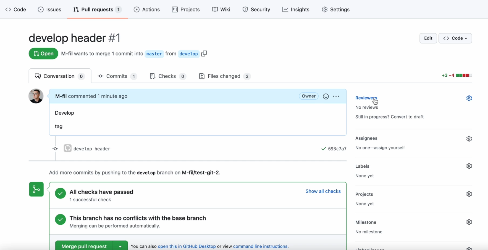

1.  git status

2.  git add [files] - добавляет файлы в stage

3.  git commit -m "comment"

4.  git log / git log --oneline //* git log - показывает подробную информацию, git log --oneline показывает краткую информацию о наших коммитах

5.  git push [rep_link] [branch_name] - команда, которые отправляет измененные содержания файла/файлов на удаленный репозиторий

6.  git reset - данная команда позволяет удалить некоторые файлы из "промежуточной" области

7.  git diff - данная команда позволяет просмотреть те строки, которые мы изменяли, либо добавляли

8.  git reset --hard  - данная команда с флагом --hard берет все изменения, которые мы проделали и вернет все именения, которые было до этого

9.  git branch - данная команда позволяет просмотреть все имеющиеся ветки, 
а также посмотреть на какой ветке я нахожусь(то есть активна) на данный момент
 
10. git branch [name_branch] - этой командой создаем новую ветку c именем name_branch

11. git checkout [name_branch] - команда, позволяющая переключиться на другую ветку

Для того, чтобы перенести код из одной ветки name_branch в main/master, чтобы в main/master отображался данный 
коммиты, которые находятся в name_branch. Чтобы перенести наши изменения, из одной ветки в другую есть два способа.
Первый способ - это сделать pull request.
12.1 Чтобы сделать pull request нам требуется перейти на вкладку Pull requests -> New pull request, далее
откроется новое окошко, в котором требуется выбрать необходимые ветки. Выбираем name_branch (это справа), а слева
выбираем main/master. Там есть веточка, которая означает, что мы хотим из содержимое векти name_branch переместить
в main/master. После этого нажимаем Create pull request. Далее мы можем опционально описать заголовок для нашего 
pull request, а также описание. После этого нажимает Create pull request
Вопрос: для чего вообще нужен pull request? Его придуиали для того, чтобы разработчики могли проверять код друг у 
друга. То есть, например, один разработчик создал шапку сайта header, в ветке develop, и хочет потом поделится
этими изменениями с другими разработчиками. Для этого ему нужнго переместить изменения и develop в main/master.
Но так как разработчики тоже люди, они могут допускать ошибки, поэтому код для тега header, требует проверки.
Именно поэтому, чтобы проверить чужой код, оставить комментарии для кода, придумали pull request.
Можно посмотреть как обычно разработчики проверяют код друг у друга.
Во первых мы можем добавить людей, которые будут смотреть наш код, их можно указать в reviewers

