1.  git status

2.  git add [files] - добавляет файлы в stage

3.  git commit -m "comment"

4.  git log / git log --oneline //* git log - показывает подробную информацию, git log --oneline показывает краткую информацию о наших коммитах

5.  git push [rep_link] [branch_name] - команда, которые отправляет измененные содержания файла/файлов на удаленный репозиторий

6.  git reset - данная команда позволяет удалить некоторые файлы из "промежуточной" области

7.  git diff - данная команда позволяет просмотреть те строки, которые мы изменяли, либо добавляли

8.  git reset --hard  - данная команда с флагом --hard берет все изменения, которые мы проделали и вернет все именения, которые было до этого

9.  git branch - данная команда позволяет просмотреть все имеющиеся ветки, 
а также посмотреть на какой ветке я нахожусь(то есть активна) на данный момент
 
10. git branch [name_branch] - этой командой создаем новую ветку c именем name_branch

11. git checkout [name_branch] - команда, позволяющая переключиться на другую ветку

Для того, чтобы перенести код из одной ветки name_branch в main/master, чтобы в main/master отображался данный 
коммиты, которые находятся в name_branch. Чтобы перенести наши изменения, из одной ветки в другую есть два способа.
Первый способ - это сделать pull request.
12.1 Чтобы сделать pull request нам требуется перейти на вкладку Pull requests -> New pull request, далее
откроется новое окошко, в котором требуется выбрать необходимые ветки. Выбираем name_branch (это справа), а слева
выбираем main/master. Там есть веточка, которая означает, что мы хотим из содержимое векти name_branch переместить
в main/master. После этого нажимаем Create pull request. Далее мы можем опционально описать заголовок для нашего 
pull request, а также описание. После этого нажимает Create pull request
Вопрос: для чего вообще нужен pull request? Его придуиали для того, чтобы разработчики могли проверять код друг у 
друга. То есть, например, один разработчик создал шапку сайта header, в ветке develop, и хочет потом поделится
этими изменениями с другими разработчиками. Для этого ему нужнго переместить изменения и develop в main/master.
Но так как разработчики тоже люди, они могут допускать ошибки, поэтому код для тега header, требует проверки.
Именно поэтому, чтобы проверить чужой код, оставить комментарии для кода, придумали pull request.
Можно посмотреть как обычно разработчики проверяют код друг у друга.
Во первых мы можем добавить людей, которые будут смотреть наш код, их можно указать в reviewers

и вводим GitHub человека, которому хотим добавить ревьювера.
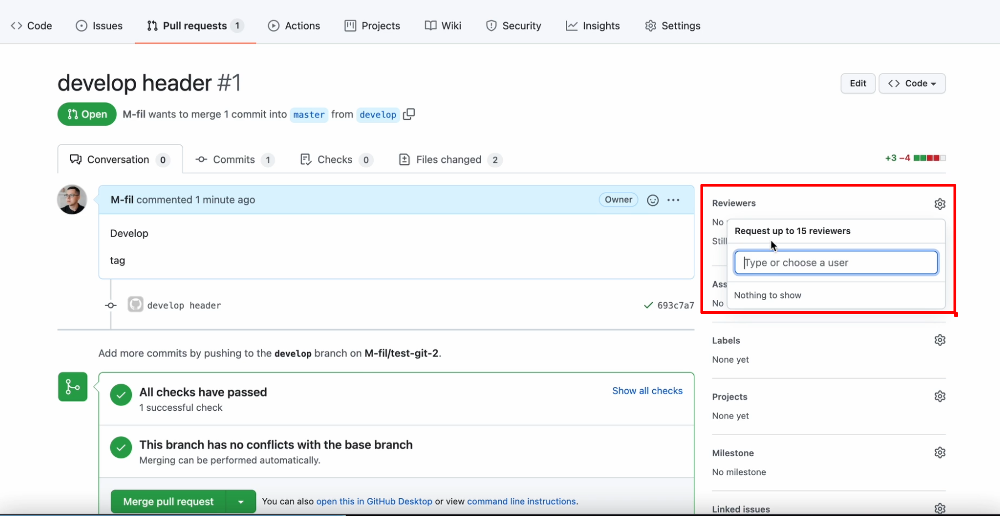
Также мы можем просмотреть все изменения, которые были сделаны конкретным разработчиком. Для этого мы можем переместиться в Files changed
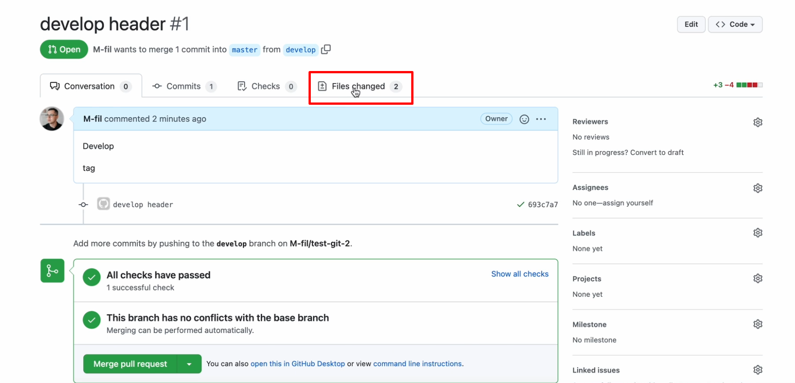
и там можно посмотреть все изменения
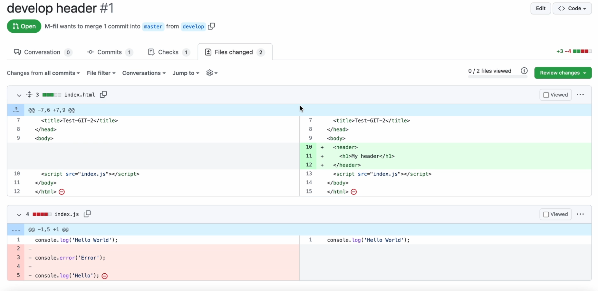
которые мы сделали в ветке name_branch, в данном слайде эта ветка называется develop
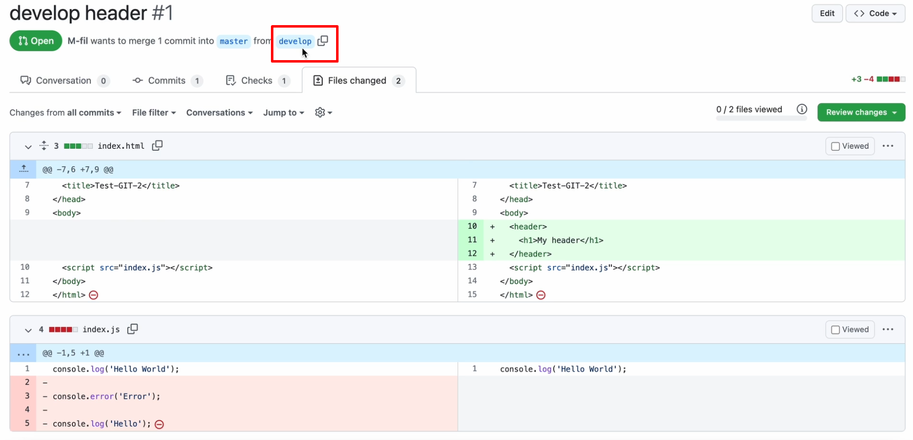
и которых нет в ветке main/master
Далее: к этим изменениям мы можем указать комментарии. Нажав на плюсик мы можем написать следующее:
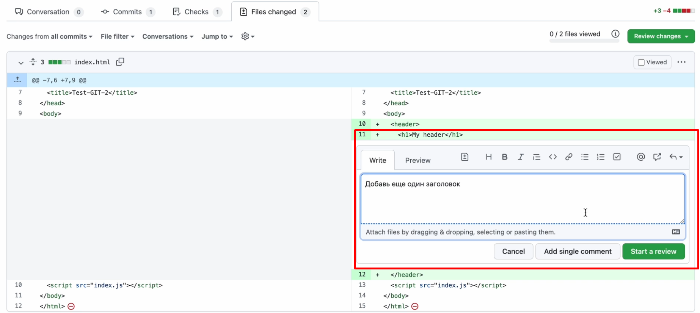
после нажимает Start a reviewers
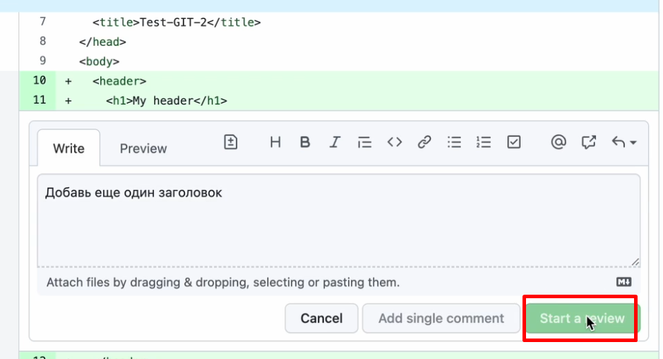
Также мы можем добавить ещё комментариев, например:
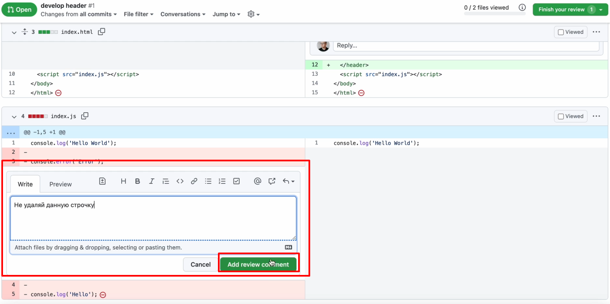
А далее, мы публикуем эти комментарии, чтобы они были видны разработчиками
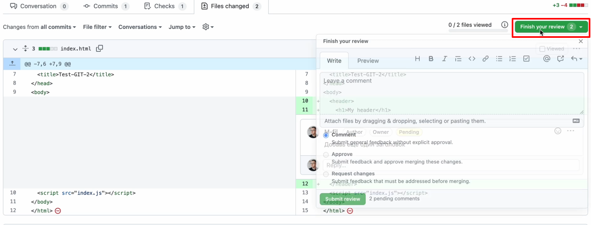
Чтобы это опубликовать, нажимаем Finish your review, пишем какой - то комментарий и 
нажимаем Submit review
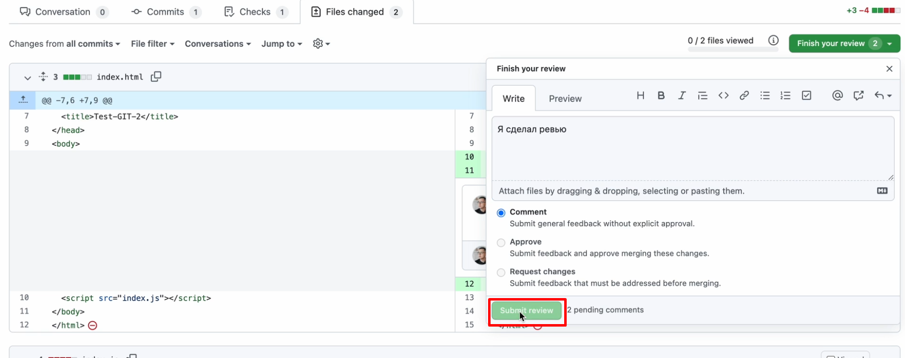
После этого, все наши комментарии будут видны всеми нашими разработчиками.
И после того, когда все замечания будут исправлены и все баги пофикшены, мы нажать данную кнопку
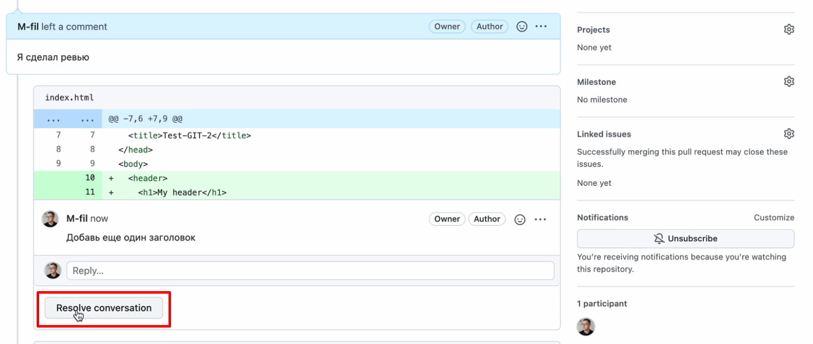
После того как все наши баги исправлены, мы сделаем слияние
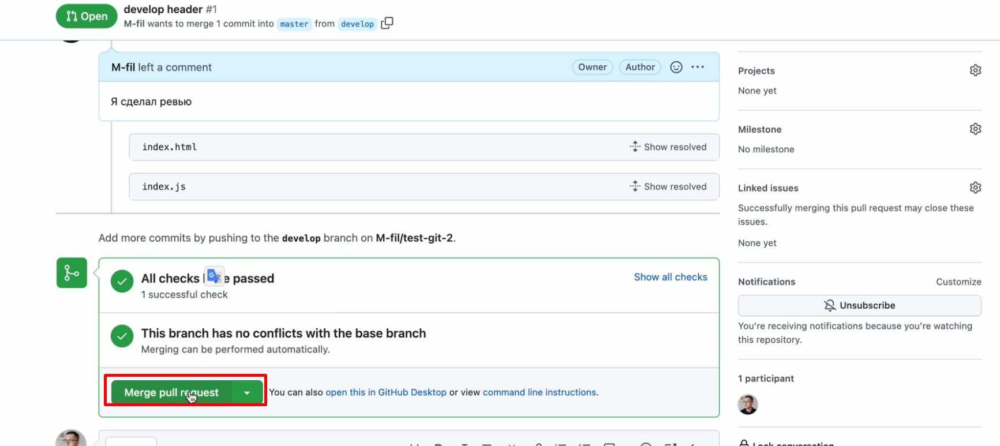
Слияние (merge) - это перенос изменений из одной ветки в другую.
Далее нажимаем confirm merge
Обычно после merge удаляют ветку, которая была замёржена. В данном случае это develop
Удаляют ветку так
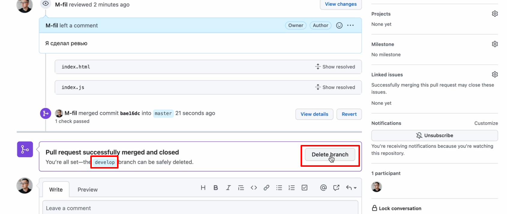
Теперь перейдем в VSCode и переместимся в ветку main/master.
Для этого напишем git checkout main/master. Теперь можно увидеть, что в index.html не произошли изменения, так как наши изменения были изменены на удаленном репозитории и локально их пока что нет. Поэтому наша задача заключается в том, чтобы перенести измененный файл из удаленного репозитория, на наш компьютер. 
Чтобы это сделать есть специальная команда git pull. Данная команда забирает изменения из ветки, которая находится на GitHub и добавляет их на нашу локальную ветку, которая находится на нашем компьютере. Полностью команда будет выглядеть так, с учетом выбранной ветки
git pull origin main/master. После выполнения этой команды
изменения отобразятся локально в нашем файле index.html  
//* --------------------------------------------------------------------------------------
Также ещё заметим, что ветка develop осталась локально, при том, мы её удалили из удаленного репозитория. Поэтому, чтобы ее удалить локально мы пропишем следующую команду git branch -d develop

12.2 Также слияние веток мы можем делать и через терминал.
Для этого есть специальная команда, которая называется git merge. Сейчас ее и протестируем. Создадим мы новую ветку, например, git branch feature/main-page, то есть это будет ветка для разработки главной страницы, и смёржим ее с помощью команды git merge. Для начала мы сделаем какие - нибудь изменения в ветке feature/main-page, например, в файле index.html, -> сделаем коммит ->
сделаем пуш.
Ну а далее, мы снова переключимся в ветку main/master. Далее мы в терминале пишем сдедующее git merge feature/main-page, для того, чтобы из ветки feature/main-page переместить код в ветку main/master

